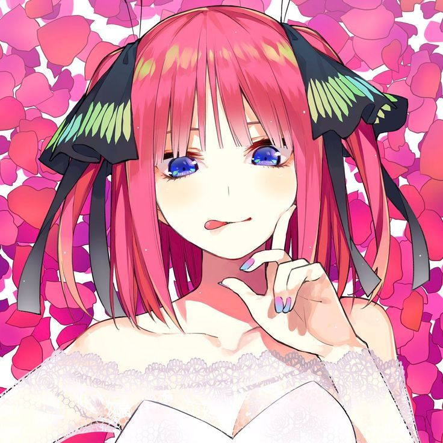

# 💫 Hi, I'm Vylqor

High-school student learning **cybersecurity**, programming and game development. I build small projects to understand how things work, experiment with new technologies and have fun along the way. 💻🔐🎮

  
  
  

## 🌸 A little about me

- 🔐 Exploring cybersecurity and secure programming
- 🎮 Creating small games and interactive projects
- 📚 Learning by building, testing and breaking things safely
- 🌸 Anime and romance enjoyer
- 🚀 Aspiring cybersecurity engineer

## 🛠️ Tools and technologies

<h3 align="center">Languages</h3>

  
  
  
  

<h3 align="center">Platforms and creative tools</h3>

  
  
  
  
  

## 🌸 Anime corner

  

  <b>♡𓆪 Nino Nakano 𓆩♡</b> 
 Romance • Tsundere • Fashion

## 📊 GitHub activity

  
  

  

  

